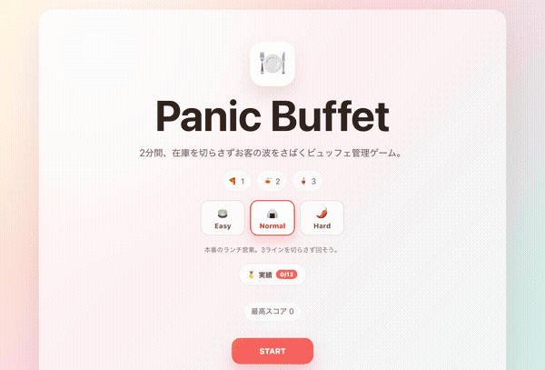

<h1 align="center">🍽️ Panic Buffet</h1>

<p align="center">
  食べ放題ビュッフェの店長になって、<b>2分間</b>お客の波をさばくブラウザ向けアーケードゲーム。<br>
  依存ゼロ・<b>Vite + TypeScript + Canvas</b> だけで作った軽量プロトタイプです。
</p>

<p align="center">
  <a href="https://sisicity4.github.io/PanicBuffet/"><b>▶ ブラウザで今すぐ遊ぶ</b></a>
</p>

<p align="center">
  <br>
  <sub>▲ 実際のプレイ画面（タイトル → ラッシュをさばく様子）</sub>
</p>

<p align="center">
  
  
  
  <a href="https://sisicity4.github.io/PanicBuffet/"></a>
</p>

---

## 🎮 遊び方

| やること | 操作 |
|---|---|
| 🍕 ピザを補充 | ボタン or キー **`1`** |
| 🍝 パスタを補充 | ボタン or キー **`2`** |
| 🥤 ドリンクを補充 | ボタン or キー **`3`** |
| ゲーム開始 / リトライ | **`Enter`** / **`Space`** |
| フルスクリーン切替 | **`F`**（`Esc`で解除） |

- お客は列に並び、料理を要求します。在庫が足りていれば**自動で提供**され、スコア＆コンボが伸びます。
- あなたの仕事は **在庫を切らさないこと**。空にして待たせると、お客がキレて帰りペナルティ（コンボもリセット）。
- ビュッフェなので、**並んで待つ間もお客は自分で取って食べ、在庫が減っていきます**（Normal以上）。先頭だけでなく全ラインに目を配る必要あり。
- 連続提供で**コンボ倍率**が最大 ×3.0 まで上昇。我慢ゲージが高いうちに捌くほどボーナス。
- 120秒終了でスコアに応じた **S / A / B / C / D** ランク判定。最高スコアは**難易度ごとに** `localStorage` 保存。

### 🎚️ 難易度

タイトルで選択。終盤に向けてお客の我慢が短くなる加速も入っています。

| | 🍵 Easy | 🍙 Normal | 🌶️ Hard |
|---|---|---|---|
| お客のペース | ゆったり | 本番のランチ | 殺到 |
| つまみ食い | なし | あり | 激しい |
| 補充 | 各ライン独立 | 各ライン独立 | **キッチン共有** — 一度に1品しか補充できない |
| ひとこと | 練習向け | 標準 | 優先順位を捌く高難度 |

> **Hard のキモ**：補充クールダウンが3ライン共有。複数のラインが同時に切れかけたとき、どこから埋めるかの取捨選択を毎秒迫られます。

## 🚀 動かす

```sh
npm install
npm run dev      # 開発サーバ（http://localhost:5173）
npm run build    # 本番ビルド（tsc + vite build → dist/）
npm run preview  # ビルド結果をプレビュー
```

## 🧱 構成

```
index.html            … #app だけ。UI は TS から生成
src/main.ts           … エントリ：シーン管理＋ゲームループ・入力
src/style.css         … 全 UI スタイル
src/game/types.ts     … GameState / Customer / Food などの型
src/game/state.ts     … 定数(CONFIG)・初期状態・最高スコア I/O
src/game/update.ts    … 1フレーム分のロジック update(state, dt, input)
src/game/render.ts    … Canvas 描画 ＋ DOM HUD 反映
```

設計の意図とゲームバランスは [`design.md`](design.md) にまとめています。

## 🛠️ 設計メモ

- **状態は単一の `GameState` に集約**。`update()` が変更し、`render()` は読むだけ。グローバル可変状態を散らさない。
- **フレームレート非依存**：`dt`（秒）ベースで更新。在庫バーやお客の移動はイージング補間でなめらかに。
- **描画はハイブリッド**：プレイエリアは DevicePixelRatio 対応の `<canvas>`、HUD・在庫パネル・タイトル/結果は DOM + CSS。
- **画像・音素材ゼロ**：絵文字＋図形＋CSS/Canvasアニメだけでゲームの手触りを表現。

---

<p align="center"><sub>Made with Vite + TypeScript · 食べ放題は計画的に。</sub></p>
